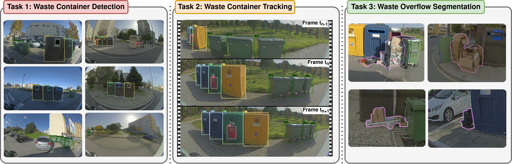

# [StreetView-Waste — WACV 2026 Main Track] StreetView-Waste: A Multi-Task Dataset for Urban Waste Management

This repository provides resources associated with the paper  
[**“StreetView-Waste: A Multi-Task Dataset for Urban Waste Management”**](https://openaccess.thecvf.com/content/WACV2026/papers/Paulo_StreetView-Waste_A_Multi-Task_Dataset_for_Urban_Waste_Management_WACV_2026_paper.pdf), accepted to the **WACV 2026 Main Track**.

StreetView-Waste is the **first fisheye street-view dataset tailored for urban waste analysis**, captured from a real waste-collection vehicle using **two 180° field-of-view cameras**. The dataset mirrors operational municipal scenarios and provides **high-quality annotations for three core tasks**: **2D object detection**, **multi-object tracking**, and **waste overflow instance segmentation**—supporting research for route optimization, asset mapping, and container status assessment.

The dataset is publicly available at: https://streetview-waste.di.ubi.pt/.

---

## Dataset Overview

StreetView-Waste comprises urban scenes recorded across multiple days and conditions (e.g., morning/afternoon, sunlight/overcast), preserving the **raw fisheye projection** (no rectification/cropping) to retain context from both road and sidewalk regions.

It supports three benchmarks:
1. **Waste Container Detection** (frame-based, multi-class bounding boxes)
2. **Waste Container Tracking & Counting** (persistent IDs across sequences)
3. **Waste Overflow Segmentation** (instance masks of unstructured litter/overflow near containers)

> **Note:** Dataset access is managed through a data license agreement to support GDPR-compliant academic use.



---

## Annotated Classes

### Waste container detection (7 classes)

StreetView-Waste includes **seven municipal container types** commonly found in European curbside collection:

- **Default** — general-purpose bins deployed on most streets  
- **Green** — glass  
- **Blue** — paper & cardboard  
- **Yellow** — lightweight packaging (plastics + metals)  
- **Biodegradable** — organic waste  
- **Oil** — household cooking oil (environmental risk stream)  
- **Battery** — small battery drop-boxes (often narrow & frequently occluded)

### Waste overflow segmentation

- **Overflowing waste / litter** around containers, annotated with **instance masks** (amorphous, unstructured targets).

---

## Dataset Characteristics

- 📷 **36,478 fisheye images** total  
- 🏷️ **14,219 images contain labeled objects** (core benchmark subset)  
- 🔲 **71,170 bounding boxes** (detection)  
- 🆔 **376 unique container identities (tracks)** (tracking benchmark)  
- 🧩 **5,149 instance masks** for overflow/litter (segmentation)  
- 🧪 Segmentation benchmark includes **7,230 images** total, with **4,197 positive images** containing waste/overflow (plus negatives for robust evaluation)

---

## Why it’s challenging

StreetView-Waste is designed to reflect real operational conditions where current models often fail, including:

- Wide-angle fisheye distortion and strong perspective variation
- Occlusions by passing vehicles and street furniture
- Illumination changes, harsh shadows, low-contrast scenes
- Visual similarity between container instances (hard re-identification)
- Amorphous overflow targets blend into cluttered backgrounds

---

## Purpose

StreetView-Waste is intended as a realistic benchmark for:

- **On-vehicle perception** for municipal waste logistics  
- **Container inventory mapping** via detection + tracking  
- **Overflow assessment** via instance segmentation and downstream volume estimation  
- Stress-testing robustness under **real street-level complexity**

---

## Baselines and reference strategies

The paper benchmarks state-of-the-art approaches for:
- **Detection:** YOLOv11 and a video object detector baseline (DiffusionVID)  
- **Tracking:** ByteTrack and BoT-SORT (tracking-by-detection)  
- **Segmentation:** multiple instance segmentation architectures evaluated on overflow masks

It also proposes two complementary, model-agnostic ideas used as **diagnostic tools** for failure modes:
- **Heuristic tracking refinement** (e.g., minimum duration filtering + temporal/spatial merging rules)  
- **Geometry-aware overflow segmentation**, augmenting RGB with inferred **depth + surface normals** (7-channel input) to help disambiguate cluttered scenes

---

## Citation

If you use StreetView-Waste, please cite:

```bibtex
@misc{paulo2025streetviewwastemultitaskdataseturban,
      title={StreetView-Waste: A Multi-Task Dataset for Urban Waste Management}, 
      author={Diogo J. Paulo and João Martins and Hugo Proença and João C. Neves},
      year={2025},
      eprint={2511.16440},
      archivePrefix={arXiv},
      primaryClass={cs.CV},
      url={https://arxiv.org/abs/2511.16440},
      note={Accepted to WACV 2026 Main Track}
}
```
